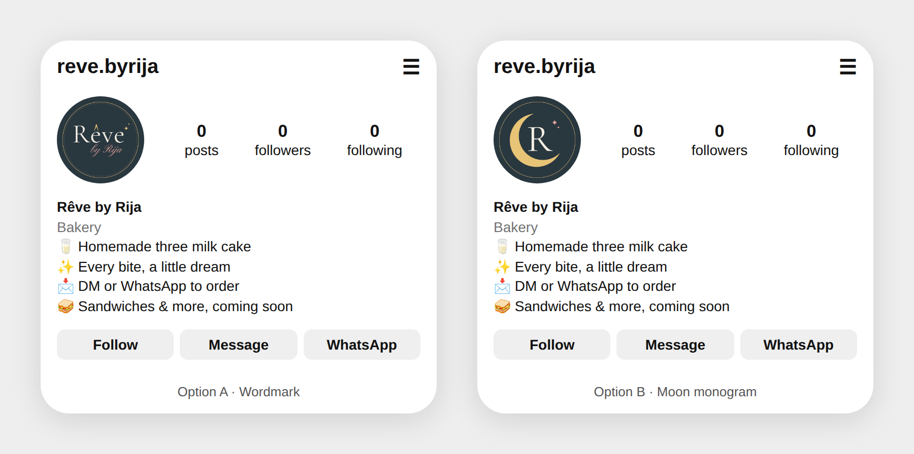

# Rêve by Rija: logo and profile picture

*Every bite, a little dream.*



## Files to use

| File | Use it for |
|---|---|
| `png/reve-profile-wordmark.png` | **Profile picture, option A.** The full name, "Rêve by Rija" (1080×1080) |
| `png/reve-profile-monogram.png` | **Profile picture, option B.** Moon + "R" monogram (1080×1080) |
| `png/reve-logo-on-slate.png` | Main logo on the brand slate background |
| `png/reve-logo-on-cream.png` | Main logo on cream |
| `png/reve-logo-transparent-light.png` | Logo with no background, **light** lettering. Place it on dark photos |
| `png/reve-logo-transparent-dark.png` | Logo with no background, **dark** lettering. Place it on light photos |
| `svg/*.svg` | The same designs as vectors, for printing (stickers, boxes, cards) at any size |

Upload the square profile PNG as-is. Instagram crops it to a circle, and the gold ring sits inside that circle.

## Colors

| | Name | Hex | Role |
|---|---|---|---|
|  | Slate | `#29373F` | **Main color.** Backgrounds, primary text |
|  | Rose | `#E9A6A0` | "by Rija" script, soft highlights |
|  | Gold | `#E8C476` | Small accents: the ê accent, sparkles, lines, the moon |
|  | Cream | `#F6EFE4` | Light backgrounds, lettering on slate |

## Fonts (all free on Google Fonts and in Canva)

- **Cormorant Garamond** for the name "Rêve", headings, and the tagline in spaced capitals
- **Pinyon Script** for "by Rija" and small handwritten touches

## Suggested bio

```
Rêve by Rija
🥛 Homemade three milk cake
✨ Every bite, a little dream
📩 DM or WhatsApp to order
🥪 Sandwiches & more, coming soon
```
Set the category to **Bakery**. Add the WhatsApp number through *Edit profile → Add WhatsApp* so a WhatsApp button shows on the profile.

## Rebuilding the files

```
cd tools
./fetch_fonts.sh          # downloads the fonts
python3 build.py          # writes svg/  (needs: pip install fonttools uharfbuzz)
node render.mjs           # writes png/  (needs: playwright)
node shot-preview.mjs     # writes instagram-preview.png
```
